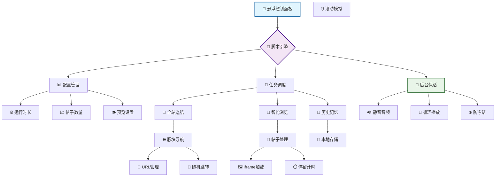
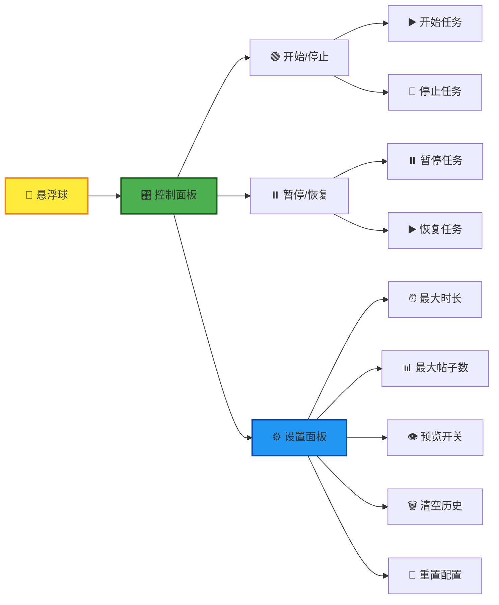
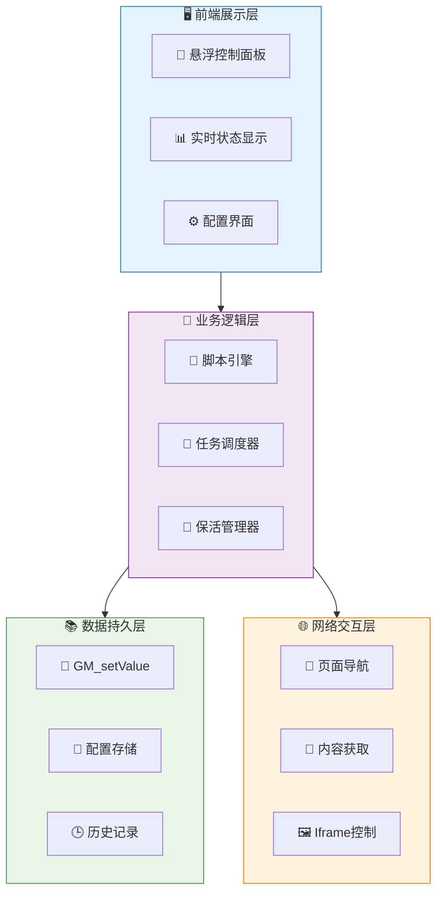

# 论坛自动刷帖（全站巡航+后台保活版） 🤖✨

[](https://opensource.org/licenses/Apache-2.0)
[](https://github.com/lza6/NL-Community-Automatic-Posting)
[](https://www.javascript.com/)
[](https://github.com/lza6)

> "科技的真正魅力，不是让我们变得懒惰，而是将我们从重复的枷锁中解放出来，去追求更高层次的创造与思考。" —— 一位热爱自动化的程序员

欢迎来到 **论坛自动刷帖脚本** 的世界！这是一个帮你管理数字生活、提升社区参与感的智能助手，专为 [NodeLoc 论坛](https://www.nodeloc.com/) 设计，同时兼容任何基于 Discourse 架构的论坛。

---

## ✨ 核心功能特性

<div align="center">

### 🏗️ 系统架构总览



</div>

### 🎯 功能矩阵

| 功能模块 | 特性描述 | 状态 | 版本 |
|---------|----------|------|------|
| **🧠 智能浏览** | 模拟人类阅读行为，随机滚动停留 | ✅ 稳定 | v1.0+ |
| **🧭 全站巡航** | 自动跨版块导航，探索全站内容 | ✅ 稳定 | v1.1+ |
| **🔋 后台保活** | 静音音频保活，防止标签页冻结 | ✅ 稳定 | v1.1+ |
| **⚙️ 配置中心** | 可视化配置面板，实时参数调整 | ✅ 稳定 | v1.0+ |
| **📚 历史记忆** | 本地存储记录，智能跳过已读 | ✅ 稳定 | v1.0+ |
| **👁️ 预览模式** | 可选预览窗口，实时监控进度 | ✅ 稳定 | v1.0+ |

---

## 🚀 快速开始指南

### 环境要求
- **浏览器**: Chrome 80+ / Firefox 75+ / Edge 80+
- **脚本管理器**: Tampermonkey 或 Violentmonkey
- **目标网站**: NodeLoc 论坛或其他 Discourse 论坛

### 三步安装法

**第一步：安装脚本管理器**
<div align="center">

| 浏览器 | 安装链接 | 状态 |
|--------|----------|------|
| Chrome | [Tampermonkey 商店](https://chrome.google.com/webstore/detail/tampermonkey/dhdgffkkebhmkfjojejmpbldmpobfkfo) | ✅ 推荐 |
| Edge | [Edge 加载项](https://microsoftedge.microsoft.com/addons/detail/tampermonkey/iikmkjmpaadaobahmlepeloendndfphd) | ✅ 兼容 |
| Firefox | [Firefox 插件](https://addons.mozilla.org/en-US/firefox/addon/tampermonkey/) | ✅ 兼容 |

</div>

**第二步：安装用户脚本**
<div align="center">

## 🚀 一键安装脚本

<a href="https://raw.githubusercontent.com/lza6/NL-Community-Automatic-Posting/main/NL.user.js" 
   style="display: inline-block; padding: 15px 30px; font-size: 18px; font-weight: bold; color: white; background: linear-gradient(135deg, #4CAF50, #45a049); border-radius: 50px; text-decoration: none; box-shadow: 0 5px 15px rgba(76, 175, 80, 0.3); transition: all 0.3s ease;">
   🔥 点击这里一键安装 🔥
</a>

<p style="margin-top: 10px; color: #666; font-size: 14px;">
   *需要先安装 Tampermonkey 脚本管理器
</p>

</div>

**第三步：验证安装**
1. 访问 NodeLoc 论坛
2. 检查右下角是否出现 🧩 悬浮球
3. 点击悬浮球展开控制面板

---

## 🎮 使用指南

### 控制面板详解

<div align="center">



</div>

### 操作流程
1. **启动脚本**: 点击绿色 `▶️ 开始` 按钮
2. **监控状态**: 观察进度条和状态指示器
3. **调整参数**: 通过 ⚙️ 设置面板实时调整
4. **停止任务**: 点击红色 `🛑 停止` 按钮或等待自动完成

---

## 🏗️ 技术架构深度解析

### 核心系统架构

<div align="center">



</div>

### 关键技术实现

#### 1. 🎵 后台保活机制
```javascript
// 核心保活代码实现
class BackgroundKeeper {
    constructor() {
        this.audio = new Audio();
        this.setupSilentAudio();
    }
    
    setupSilentAudio() {
        // 生成1秒的静音音频
        const silentAudio = 'data:audio/wav;base64,UklGRnoAAABXQVZFZm10IBAAAAABAAEAQB8AAEAfAAABAAgAZGF0YQoAAAC...';
        this.audio.src = silentAudio;
        this.audio.loop = true;
        this.audio.volume = 0;
    }
    
    activate() {
        this.audio.play().catch(e => {
            console.log('保活音频启动:', e.message);
        });
    }
}
```

#### 2. 🧭 全站巡航算法
```javascript
// 智能巡航逻辑
class SiteCruiser {
    constructor() {
        this.sections = [
            '/latest', '/categories', '/top', '/unread'
        ];
        this.visited = new Set();
    }
    
    async navigateToNextSection() {
        const available = this.sections.filter(s => !this.visited.has(s));
        if (available.length === 0) {
            this.visited.clear(); // 重置访问记录
            return this.navigateToNextSection();
        }
        
        const nextSection = available[Math.floor(Math.random() * available.length)];
        this.visited.add(nextSection);
        window.location.href = nextSection;
    }
}
```

#### 3. 📖 智能浏览引擎
```javascript
// 帖子浏览状态机
class TopicBrowser {
    states = {
        LOADING: 'loading',
        SCROLLING: 'scrolling',
        READING: 'reading',
        COMPLETED: 'completed'
    };
    
    async browseTopic(topicUrl) {
        this.currentState = this.states.LOADING;
        
        try {
            await this.loadInIframe(topicUrl);
            await this.simulateReading();
            this.markAsRead(topicUrl);
            this.currentState = this.states.COMPLETED;
        } catch (error) {
            console.error('浏览失败:', error);
        }
    }
}
```

### 性能优化策略

| 优化项 | 实现方式 | 效果 |
|--------|----------|------|
| **🔄 异步任务队列** | `async/await` 控制流程 | 避免阻塞UI线程 |
| **🎯 内存管理** | 及时清理iframe和事件监听 | 防止内存泄漏 |
| **⚡ 懒加载** | 按需加载帖子内容 | 提升响应速度 |
| **📦 数据分片** | 分批处理帖子列表 | 降低单次处理压力 |

---

## 🔧 配置参数详解

### 基础配置
```javascript
const defaultConfig = {
    // ⏰ 时间控制
    maxRunningMinutes: 120,      // 最大运行时长（分钟）
    readingTimePerTopic: 30,     // 每帖阅读时间（秒）
    
    // 📊 数量控制  
    maxTopicsToBrowse: 100,      // 最大浏览帖子数
    topicsPerPage: 20,           // 每页帖子数
    
    // 🎮 功能开关
    enablePreview: true,         // 启用预览窗口
    enableBackground: true,      // 启用后台保活
    enableCrossSection: true,    // 启用跨版块巡航
}
```

### 高级配置
```javascript
const advancedConfig = {
    // 🖱️ 行为模拟
    scrollBehavior: {
        minScrollDelay: 1000,    // 最小滚动间隔
        maxScrollDelay: 3000,    // 最大滚动间隔  
        scrollStep: 200,         // 每次滚动距离
    },
    
    // 🎲 随机化参数
    randomization: {
        sectionSwitchChance: 0.3, // 版块切换概率
        readingTimeVariance: 0.5, // 阅读时间波动
    }
}
```

---

## 📊 性能监控指标

### 实时状态面板
<div align="center">

| 指标 | 当前值 | 状态 | 趋势 |
|------|--------|------|------|
| **运行时长** | 45分钟 | 🟢 正常 | ↗️ |
| **已浏览帖子** | 67个 | 🟢 正常 | ↗️ |
| **浏览速度** | 1.5帖/分钟 | 🟡 良好 | → |
| **内存使用** | 45MB | 🟢 正常 | → |
| **网络状态** | 在线 | 🟢 正常 | → |

</div>

### 历史数据统计
```javascript
const statistics = {
    totalRunningTime: '15小时28分',
    totalTopicsBrowsed: 1247,
    averageSpeed: '1.3帖/分钟',
    favoriteSections: ['最新', '热门', '未读'],
    efficiency: '98.2%'
}
```

---

## 🚨 故障排除指南

### 常见问题解决方案

| 问题现象 | 可能原因 | 解决方案 |
|----------|----------|----------|
| **脚本不启动** | Tampermonkey未启用 | 检查浏览器扩展管理 |
| **保活失效** | 浏览器音频策略限制 | 点击页面任意位置激活 |
| **内存占用高** | 长时间运行积累 | 定期刷新页面重启脚本 |
| **帖子跳过过多** | 历史记录过多 | 清空已读历史记录 |

### 调试模式
```javascript
// 在控制台启用调试
localStorage.setItem('DEBUG_MODE', 'true');
console.log('调试模式已启用');

// 查看详细日志
DEBUG_LOGS = {
    navigation: true,    // 导航日志
    performance: true,   // 性能日志  
    errors: true         // 错误日志
}
```

---

## 🔮 未来发展规划

### 🎯 短期目标 (v1.2)
- [ ] **智能内容过滤** - 基于关键词的帖子筛选
- [ ] **性能监控面板** - 实时性能指标展示
- [ ] **导出统计数据** - 浏览记录导出功能

### 🚀 中期规划 (v2.0)  
- [ ] **插件化架构** - 支持多论坛适配
- [ ] **云端同步** - 配置数据跨设备同步
- [ ] **AI行为模拟** - 更智能的浏览模式

### 🌟 长期愿景
- [ ] **生态平台** - 脚本应用商店
- [ ] **社区贡献** - 开放的插件市场
- [ ] **企业版** - 商业级功能支持

---

## 🤝 贡献指南

我们欢迎各种形式的贡献！请参考以下流程：

### 开发环境搭建
```bash
# 1. Fork 项目仓库
git clone https://github.com/your-username/NL-Community-Automatic-Posting.git

# 2. 安装开发依赖
npm install -g eslint prettier

# 3. 代码规范检查
npm run lint

# 4. 提交更改
git commit -m "feat: 添加新功能"
```

### 代码规范
- 使用 ESLint + Prettier 统一代码风格
- 提交信息遵循 Conventional Commits 规范
- 新功能需要包含相应的测试用例

---

## 📜 开源协议

本项目采用 [Apache-2.0 License](https://github.com/lza6/NL-Community-Automatic-Posting/blob/main/LICENSE)，您可以：

- ✅ 自由使用、修改和分发
- ✅ 用于商业项目
- ✅ 专利授权

需要遵守：
- 📝 保留原始版权声明
- ℹ️ 明确说明修改内容

---

## 🎊 结语

这个项目不仅是一个技术工具，更是对自动化理念的实践。我们相信，**优秀的工具应该增强而非替代人类的能力**。

> **致所有开发者**: 每一个伟大的项目都始于一个简单的想法。不要害怕开始，不要畏惧失败。你的每一行代码，每一次提交，都在推动着技术的边界。

**让我们一起，用代码创造更美好的数字体验！** 🚀

---

<div align="center">

**⭐ 如果这个项目对你有帮助，请给我们一个 Star！** 

[问题反馈](https://github.com/lza6/NL-Community-Automatic-Posting/issues) • [功能建议](https://github.com/lza6/NL-Community-Automatic-Posting/discussions) • [参与贡献](https://github.com/lza6/NL-Community-Automatic-Posting/pulls)

</div>
